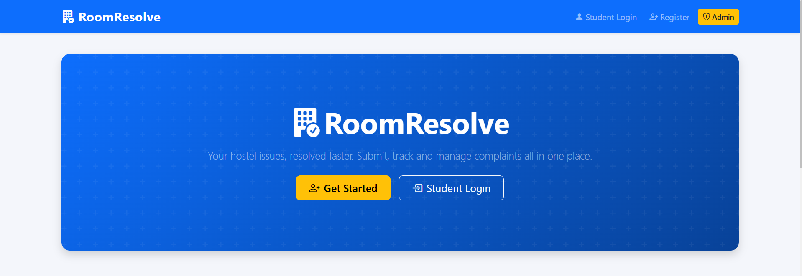
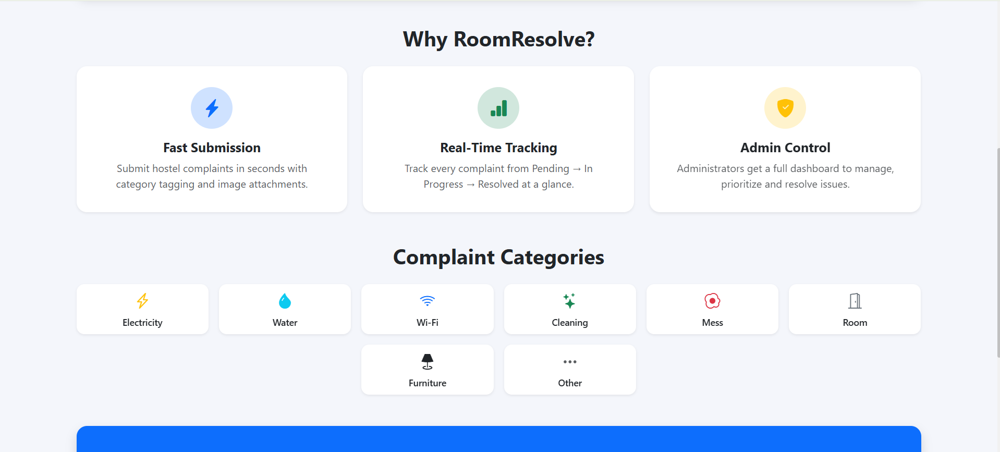
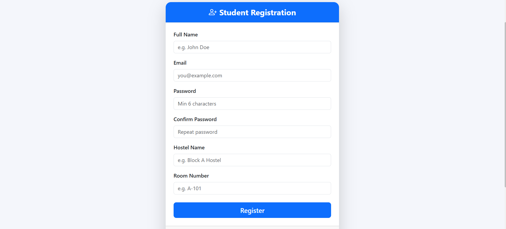
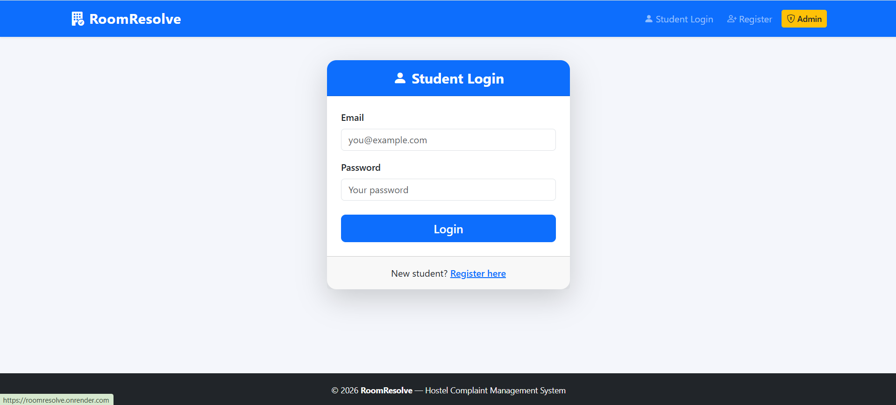
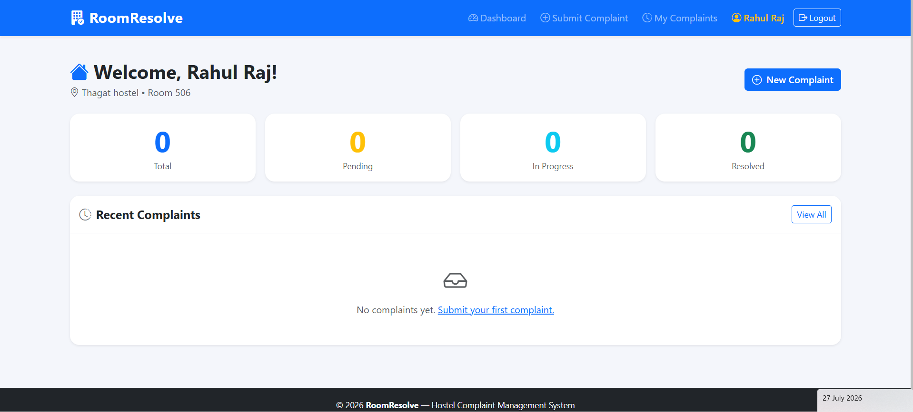
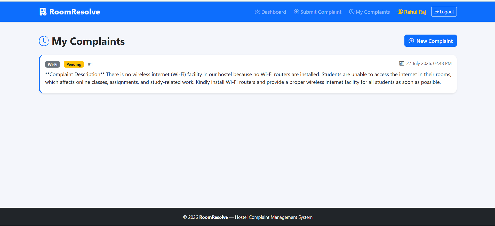
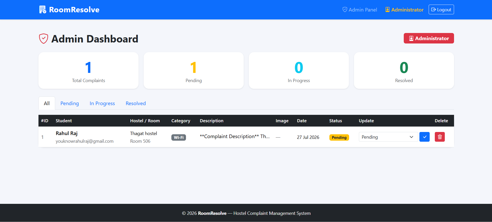
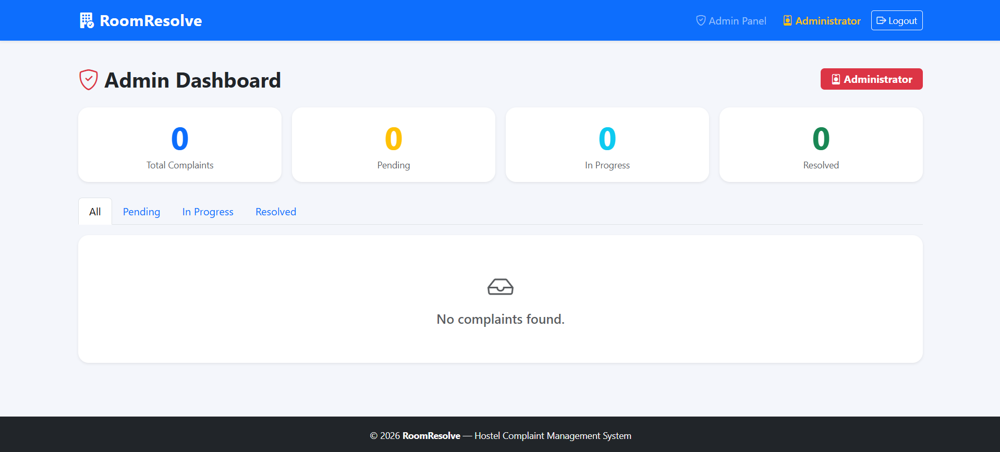

# 🏠 RoomResolve

> **A Smart Student Hostel Complaint Management System**

RoomResolve is a web-based hostel complaint management system developed by **Rahul Raj** as a **solo project** for **VibeCoding Hackathon 6.0**. It enables students to report hostel issues, upload supporting images, track complaint status, and allows administrators to efficiently manage and resolve complaints through a centralized dashboard.

---

# 👨‍💻 Developer

**Name:** Rahul Raj

**Team Name:** Beyond Binary *(Solo Participant)*

**Hackathon:** VibeCoding Hackathon 6.0

**Role:** Full Stack Developer

- Designed UI
- Developed Backend using Flask
- Integrated SQLite Database
- Implemented Authentication
- Built Admin Dashboard
- Deployed on Render

---

# 🌐 Live Demo

**Live Website**

https://roomresolve.onrender.com/

**GitHub Repository**

> Paste your GitHub repository link here.

---

# 🎯 Problem Statement

Hostel students often face maintenance issues such as electricity failures, water leakage, Wi-Fi problems, cleaning delays, and damaged furniture. In many hostels, complaints are managed manually, resulting in delayed resolutions and lack of transparency.

---

# 💡 Solution

RoomResolve provides a centralized digital platform where students can:

- Register and log in securely
- Submit complaints with images
- Track complaint status in real time

Administrators can:

- View all complaints
- Update complaint status
- Monitor complaint statistics
- Delete resolved complaints

This makes hostel complaint management faster, transparent, and organized.

---

# ✨ Features

## 👨‍🎓 Student Module

- Student Registration
- Secure Login
- Submit Complaint
- Upload Complaint Images
- Complaint History
- Track Complaint Status

## 👨‍💼 Admin Module

- Secure Admin Login
- Dashboard with Statistics
- View All Complaints
- Update Complaint Status
- Delete Complaints

---

# 🛠 Tech Stack

| Layer | Technology |
|--------|------------|
| Frontend | HTML5, CSS3, Bootstrap 5 |
| Backend | Python, Flask |
| Database | SQLite, Flask-SQLAlchemy |
| Authentication | Flask Sessions, Werkzeug |
| Forms | Flask-WTF, WTForms |
| Deployment | Render |
| Version Control | Git & GitHub |

---

# 📂 Project Structure

```
RoomResolve/
│
├── app.py
├── config.py
├── models.py
├── forms.py
├── requirements.txt
├── README.md
│
├── static/
│   ├── css/
│   ├── js/
│   └── uploads/
│
└── templates/
    ├── index.html
    ├── login.html
    ├── register.html
    ├── student_dashboard.html
    ├── submit_complaint.html
    ├── complaint_history.html
    ├── admin_login.html
    └── admin_dashboard.html
```

---

# ⚙ Installation

### Clone Repository

```bash
git clone <your-github-repository-url>
cd RoomResolve
```

### Create Virtual Environment

```bash
python -m venv venv
```

### Activate Virtual Environment

Windows

```bash
venv\Scripts\activate
```

Linux/macOS

```bash
source venv/bin/activate
```

### Install Dependencies

```bash
pip install -r requirements.txt
```

### Run Application

```bash
python app.py
```

---

# 🔑 Demo Credentials

## Student

Create a new account using the registration page.

## Admin

Email

```
admin@roomresolve.com
```

Password

```
admin123
```

> **Note:** These credentials are provided **only for hackathon evaluation and demonstration purposes**.

---

# 📸 Screenshots

## 🏠 Home Page




---

## 📝 Student Registration



---

## 📝 Student login



---

## 👨‍🎓 Student Dashboard



---

## 📝 Submit Complaint



---

## 📋 Complaint History



---

## 👨‍💼 Admin Dashboard



---

# 🔮 Future Scope

- Email Notifications
- WhatsApp Notifications
- AI-based Complaint Categorization
- Analytics Dashboard
- Mobile Application
- Multi-Hostel Support
- Student hostel biometric system
- Role-based Access Control
- Cloud Database Integration

---

# 🏆 Project Highlights

- Secure Authentication
- Image Upload Support
- Complaint Tracking
- Admin Management Dashboard
- Responsive User Interface
- Clean Code Structure
- Flask-Based Architecture
- Live Deployment on Render

---

# 👨‍💻 About the Developer

This project was independently designed, developed, tested, and deployed by **Rahul Raj** as a solo participant for **VibeCoding Hackathon 6.0**.

---

# 📄 License

This project is intended for educational purposes and hackathon demonstration.

---

## ⭐ Thank you for visiting this repository!

If you found this project useful, consider giving it a ⭐ on GitHub.
